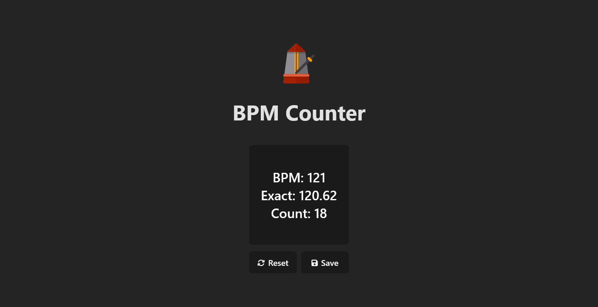

# BPM Counter

This project is a simple BPM (Beats Per Minute) Counter implemented using React and Vite frameworks. It allows users to calculate the BPM by clicking a button and displays the BPM value in real-time.



## Features

- Click the button to start measuring the BPM.
- Calculates the BPM based on the time intervals between clicks.
- Displays both the exact BPM, the rounded BPM values, and the click count.
- Reset button to clear the BPM data and start over.
- Save button to save the BPM data to a text file.

## Technologies Used

- React
- Vite
- FontAwesome for icons

## Getting Started

### Prerequisites

- Node.js and npm (or yarn) installed on your machine.

### Installation

1. Clone the repository:

```bash
git clone https://github.com/your-username/bpm-counter.git
```

2. Navigate to the project directory:

```bash
cd bpm-counter
```

3. Install dependencies:

```bash
npm install
# or
yarn
```

### Usage

1. Start the development server:

```bash
npm run dev
# or
yarn dev
```

2. Open your browser and go to http://localhost:3000 to view the BPM Counter app.

3. Click the button to start measuring the BPM. The BPM value will be displayed in real-time.

4. Use the reset button to clear the BPM data and start over.

5. Use the save button to save the BPM data to a text file.